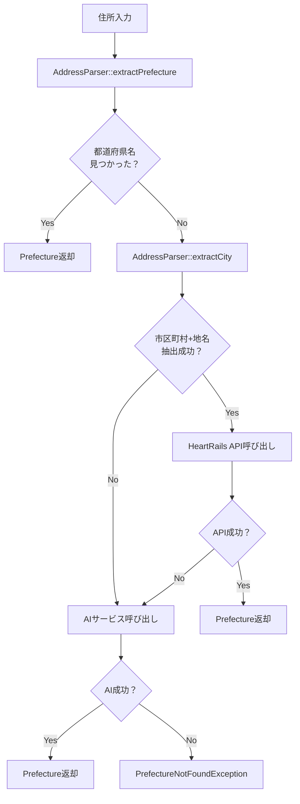

# 都道府県抽出API 実装計画書

## プロジェクト概要

### 目的
顧客から送られてくる住所情報から都道府県を抽出するAPIを構築する。現在95%の成功率を、AI（OpenAI/Gemini）を活用して限りなく100%に近づける。

### 住所入力パターン
システムは以下のような様々な住所パターンに対応する：
- `〒314-0007 茨城県鹿嶋市神向寺後山２６−２`（郵便番号＋都道府県＋市区町村＋詳細）
- `茨城県鹿嶋市神向寺後山２６−２`（都道府県＋市区町村＋詳細）
- `鹿嶋市神向寺後山２６−２`（市区町村＋詳細のみ）
- `〒314-0007 鹿嶋市神向寺後山２６−２`（郵便番号＋市区町村＋詳細）

### 技術要件
- **フレームワーク**: Laravel 12
- **開発手法**: TDD（テスト駆動開発）- t-wadaさんの手法に準拠
- **アーキテクチャ**: クリーンアーキテクチャ
- **外部API**:
  - HeartRails Geo API（都道府県検索）
  - OpenAI API / Gemini API（AIフォールバック）
- **言語**: PHP 8.2+

### 処理フロー（3段階）
1. **都道府県名直接抽出**: 住所文字列に47都道府県名が含まれている場合、正規表現で抽出して即座に返却（APIコールなし）
2. **都道府県API検索**: 都道府県名が見つからない場合、「市区町村＋地名」を抽出してHeartRails Geo APIに問い合わせ
3. **AIフォールバック**: 都道府県APIが失敗した場合、OpenAI APIまたはGemini APIで最終的に抽出

## システム構成

### ディレクトリ構造

```
extend-prefecture-api/
├── app/
│   ├── Http/
│   │   ├── Controllers/
│   │   │   └── PrefectureController.php
│   │   └── Requests/
│   │       └── ExtractPrefectureRequest.php
│   ├── UseCases/
│   │   └── ExtractPrefectureUseCase.php
│   ├── Services/
│   │   ├── PrefectureResolver.php
│   │   └── AddressParser.php
│   ├── Repositories/
│   │   ├── Interfaces/
│   │   │   ├── PrefectureExtractorInterface.php
│   │   │   └── HeartRailsApiInterface.php
│   │   ├── PrefectureExtractorRepository.php
│   │   └── HeartRailsApiRepository.php
│   ├── ExternalServices/
│   │   ├── Interfaces/
│   │   │   └── AIServiceInterface.php
│   │   ├── OpenAIService.php
│   │   └── GeminiService.php
│   └── Providers/
│       └── PrefectureServiceProvider.php
├── config/
│   └── prefectures.php
├── resources/
│   └── views/
│       └── prefecture/
│           └── index.blade.php
├── routes/
│   └── web.php
└── tests/
    ├── Feature/
    │   └── PrefectureExtractionTest.php
    └── Unit/
        ├── UseCases/
        │   └── ExtractPrefectureUseCaseTest.php
        ├── Services/
        │   ├── PrefectureResolverTest.php
        │   └── AddressParserTest.php
        ├── Repositories/
        │   └── HeartRailsApiRepositoryTest.php
        └── ExternalServices/
            ├── OpenAIServiceTest.php
            └── GeminiServiceTest.php
```

## 実装詳細

### 1. フロントエンド

#### 画面仕様（Bladeテンプレート）
- **ファイル**: `resources/views/prefecture/index.blade.php`
- **構成要素**:
  - 住所入力フォーム
  - 送信ボタン
  - レスポンス表示エリア
- **バリデーション**:
  - 文字列型
  - 最大200文字

#### サンプルUI構成
```html
<form>
  <div class="form-group">
    <label>住所を入力してください</label>
    <input type="text" maxlength="200" required>
  </div>
  <button type="submit">都道府県を抽出</button>
</form>
<div id="result">
  <!-- APIレスポンス表示エリア -->
</div>
```

### 2. バックエンド

#### 2.1 ルーティング（routes/web.php）
```php
// 画面表示
Route::get('/prefecture', [PrefectureController::class, 'index']);

// API エンドポイント
Route::post('/api/extract-prefecture', [PrefectureController::class, 'extract']);
```

#### 2.2 コントローラー（PrefectureController.php）
**責務**: HTTPリクエスト/レスポンスの処理
- `index()`: 入力画面表示
- `extract()`: 都道府県抽出処理の実行

#### 2.3 リクエストバリデーション（ExtractPrefectureRequest.php）
**責務**: 入力値の検証
- 住所: 必須、文字列、最大200文字

#### 2.4 ユースケース（ExtractPrefectureUseCase.php）
**責務**: ビジネスロジックの実装
- 住所文字列を受け取り、都道府県を抽出
- PrefectureResolverサービスを呼び出し、3段階の処理を実行
- エラーハンドリング

#### 2.5 サービス層

##### PrefectureResolver（PrefectureResolver.php）
**責務**: 都道府県抽出の主要ロジック実装
- `resolveFromAddress(string $clientAddress): Prefecture`
- 3段階の処理フローを制御:
  1. `extractPrefecture()`: 47都道府県名の直接抽出
  2. `extractCity()`: 市区町村＋地名の抽出とHeartRails API呼び出し
  3. AIサービスへのフォールバック

```php
class PrefectureResolver
{
    public function resolveFromAddress(string $clientAddress): Prefecture
    {
        // 1. 都道府県名の直接抽出
        $extractedPrefecture = $this->extractPrefecture($clientAddress);
        if (!is_null($extractedPrefecture)) {
            return new Prefecture($extractedPrefecture);
        }

        // 2. 市区町村+地名でHeartRails API検索
        $extractedCity = $this->extractCity($clientAddress);
        if (!is_null($extractedCity)) {
            try {
                $location = $this->heartRailsApi->findByAddress($extractedCity);
                return new Prefecture($location->prefecture());
            } catch (Exception $e) {
                // 3. AIサービスへフォールバック
                return $this->aiService->extractPrefecture($clientAddress);
            }
        }

        throw new PrefectureNotFoundException('都道府県が見つかりませんでした。');
    }
}
```

##### AddressParser（AddressParser.php）
**責務**: 住所文字列の解析処理
- `extractPrefecture(string $address): ?int`: 47都道府県名の抽出
- `extractCity(string $address): ?string`: 市区町村＋地名の抽出
- 正規表現による住所成分の分解

```php
class AddressParser
{
    /**
     * 都道府県名の直接抽出（正規表現）
     */
    private function extractPrefecture(string $clientAddress): ?int
    {
        $prefecturePattern = implode('|', array_map('preg_quote',
            config('prefectures.list'),
            array_fill(0, count(config('prefectures.list')), '/')
        ));

        $pattern = '/(' . $prefecturePattern . ')/u';

        if (preg_match($pattern, $clientAddress, $matches)) {
            return array_search($matches[0], config('prefectures.list'), true);
        }

        return null;
    }

    /**
     * 市区町村+地名の抽出
     */
    private function extractCity(string $clientAddress): ?string
    {
        // 1. 郵便番号を除去（〒123-4567 パターン）
        $pattern = '/〒?\s*[0-9０-９]{3}-?[0-9０-９]{4}\s*/u';
        $addressWithoutPostal = preg_replace($pattern, '', $clientAddress);

        // 2. 旧字表記を除去（大字、字、小字）
        $pattern = '/(大字|字|小字)\s*/u';
        $addressWithoutOldChar = preg_replace($pattern, '', $addressWithoutPostal);

        // 3. 丁目以降の住所要素を削除
        $pattern = '/[0-9０-９]+(丁目|番|号|[-－][0-9０-９]+)*\s?.*$/u';
        $deletedAfterBlockAddress = preg_replace($pattern, '', $addressWithoutOldChar);

        // 4. 市区町村郡島+地名の部分を抽出
        $pattern = '/[ぁ-んァ-ン一-龠々]+[市区町村郡島]+[ぁ-んァ-ン一-龠々]+/u';
        if (preg_match($pattern, $deletedAfterBlockAddress, $matches)) {
            return $matches[0];
        }

        return null;
    }
}
```

#### 2.6 リポジトリ

##### HeartRails API インターフェース（HeartRailsApiInterface.php）
```php
interface HeartRailsApiInterface
{
    public function findByAddress(string $extractedCity): ?Location;
}
```

##### HeartRails API実装（HeartRailsApiRepository.php）
**責務**: HeartRails Geo APIとの通信
- 市区町村名から都道府県情報を取得
- APIエラーハンドリング

```php
class HeartRailsApiRepository implements HeartRailsApiInterface
{
    public function findByAddress(string $extractedCity): ?Location
    {
        $response = $this->http->request('GET', self::HEART_RAILS_GEO_API_URL, [
            'query' => [
                'method' => 'suggest',
                'matching' => 'like',
                'keyword' => $extractedCity,
            ],
        ]);

        $contents = json_decode($response->getBody()->getContents(), true);

        if (isset($contents['response']['error'])) {
            throw new ExternalResourceNotFoundException();
        }

        return new Location($contents['response']['location'][0]);
    }
}
```

##### AIサービス インターフェース（PrefectureExtractorInterface.php）
```php
interface PrefectureExtractorInterface
{
    public function extract(string $address): string;
}
```

##### 実装（PrefectureExtractorRepository.php）
**責務**: AIサービスの呼び出しと結果の返却

#### 2.7 外部サービス

##### インターフェース（AIServiceInterface.php）
```php
interface AIServiceInterface
{
    public function extractPrefecture(string $address): string;
}
```

##### OpenAI実装（OpenAIService.php）
- OpenAI APIを使用した都道府県抽出
- GPT-3.5/GPT-4モデルの利用
- 京都府特殊住所（「下ル」「上ル」等）に対応
- 誤字や新設地名に対する柔軟な推定

##### Gemini実装（GeminiService.php）
- Gemini APIを使用した都道府県抽出
- Gemini Proモデルの利用
- 文脈理解による高精度な都道府県抽出

```php
// AI APIのプロンプト例
$prompt = "以下の住所から都道府県名のみを抽出してください。47都道府県のいずれかを返してください。
住所: {$address}
注意事項:
- 京都の「下ル」「上ル」「東入」「西入」表記に対応
- 誤字がある場合は最も近い都道府県を推定
- 都道府県名のみを返答（例：「東京都」「大阪府」「北海道」）";
```

#### 2.8 設定ファイル

##### 都道府県マスターデータ（config/prefectures.php）
```php
<?php

return [
    'list' => [
        1 => '北海道',
        2 => '青森県',
        3 => '岩手県',
        // ... 47都道府県全て
        47 => '沖縄県'
    ]
];
```

#### 2.9 サービスプロバイダー（PrefectureServiceProvider.php）
**責務**: 依存性注入の設定
- 環境変数に基づいてAIサービスを切り替え
- インターフェースと実装のバインディング

### 3. 環境設定

#### .env設定例
```env
# AI Service Configuration
AI_SERVICE_PROVIDER=openai  # 'openai' or 'gemini'

# HeartRails Geo API Configuration
HEARTRAILS_GEO_API_URL=https://geoapi.heartrails.com/api/json

# OpenAI Configuration
OPENAI_API_KEY=your_openai_api_key_here
OPENAI_MODEL=gpt-3.5-turbo
OPENAI_MAX_TOKENS=100
OPENAI_TEMPERATURE=0.3

# Gemini Configuration
GEMINI_API_KEY=your_gemini_api_key_here
GEMINI_MODEL=gemini-pro
GEMINI_MAX_TOKENS=100
GEMINI_TEMPERATURE=0.3

# API Retry Configuration
API_MAX_RETRIES=3
API_TIMEOUT=30
```

## テスト戦略（TDD）

### テスト駆動開発のサイクル
1. **Red Phase**: 失敗するテストを書く
2. **Green Phase**: テストを通す最小限のコードを書く
3. **Refactor Phase**: コードを改善する

### テストケース

#### Feature Test（E2Eテスト）

##### 正常系テスト
- **都道府県名直接抽出**: `〒314-0007 茨城県鹿嶋市神向寺後山２６−２`
- **都道府県名のみ**: `茨城県鹿嶋市神向寺後山２６−２`
- **HeartRails API検索**: `鹿嶋市神向寺後山２６−２`
- **郵便番号＋市区町村（前処理対応）**: `〒314-0007 鹿嶋市神向寺後山２６−２`
- **旧字表記（前処理対応）**: `鹿嶋市大字神向寺後山２６−２`
- **京都特殊住所（AI対応）**: `京都市中京区烏丸通二条下ル二条殿町538`
- **誤字住所（AI対応）**: `東京都新宿区歌舞伎町`（「歌舞伎町」→「歌舞伎町」の誤字パターン）

##### 異常系テスト
- 空文字列の処理
- 200文字超過の処理
- 都道府県が特定できない住所の処理
- HeartRails API通信エラー
- AI API通信エラー

#### Unit Test
- **PrefectureResolverTest**: 3段階の処理フローのテスト
- **AddressParserTest**: 住所解析ロジックのテスト
- **HeartRailsApiRepositoryTest**: 都道府県API通信のテスト
- **OpenAIServiceTest**: OpenAI APIのモックテスト
- **GeminiServiceTest**: Gemini APIのモックテスト
- **ExtractPrefectureUseCaseTest**: ユースケースのロジックテスト
- **バリデーションテスト**: 入力値検証のテスト

### サンプルテストコード

#### Feature Test例
```php
// tests/Feature/PrefectureExtractionTest.php

// 1. 都道府県名直接抽出のテスト
public function test_can_extract_prefecture_directly_from_address()
{
    $response = $this->post('/api/extract-prefecture', [
        'address' => '〒314-0007 茨城県鹿嶋市神向寺後山２６−２'
    ]);

    $response->assertStatus(200);
    $response->assertJson(['prefecture' => '茨城県']);
}

// 2. HeartRails API検索のテスト
public function test_can_extract_prefecture_via_heartrails_api()
{
    $response = $this->post('/api/extract-prefecture', [
        'address' => '鹿嶋市神向寺後山２６−２'
    ]);

    $response->assertStatus(200);
    $response->assertJson(['prefecture' => '茨城県']);
}

// 3. AIフォールバックのテスト
public function test_falls_back_to_ai_when_heartrails_fails()
{
    // HeartRails APIを失敗させるモック
    $this->mock(HeartRailsApiInterface::class)
         ->shouldReceive('findByAddress')
         ->andThrow(new ExternalResourceNotFoundException());

    $response = $this->post('/api/extract-prefecture', [
        'address' => '不明な住所'
    ]);

    $response->assertStatus(200);
    // AI APIが呼ばれることを確認
}
```

#### Unit Test例
```php
// tests/Unit/Services/AddressParserTest.php
public function test_can_extract_prefecture_name_directly()
{
    $parser = new AddressParser();

    $result = $parser->extractPrefecture('茨城県鹿嶋市神向寺後山２６−２');

    $this->assertEquals('茨城県', $result);
}

public function test_can_extract_city_and_town()
{
    $parser = new AddressParser();

    $result = $parser->extractCity('鹿嶋市神向寺後山２６−２');

    $this->assertEquals('鹿嶋市神向寺後山', $result);
}

// 失敗パターン対応のテスト
public function test_can_extract_city_with_postal_code()
{
    $parser = new AddressParser();

    $result = $parser->extractCity('〒314-0007 鹿嶋市神向寺後山２６−２');

    $this->assertEquals('鹿嶋市神向寺後山', $result);
}

public function test_can_extract_city_with_old_character()
{
    $parser = new AddressParser();

    $result = $parser->extractCity('鹿嶋市大字神向寺後山２６−２');

    $this->assertEquals('鹿嶋市神向寺後山', $result);
}

// tests/Unit/Services/PrefectureResolverTest.php
public function test_falls_back_to_ai_for_kyoto_special_address()
{
    $heartRailsMock = $this->mock(HeartRailsApiInterface::class);
    $aiServiceMock = $this->mock(AIServiceInterface::class);

    $heartRailsMock->shouldReceive('findByAddress')
                   ->andThrow(new ExternalResourceNotFoundException());

    $aiServiceMock->shouldReceive('extractPrefecture')
                  ->with('京都市中京区烏丸通二条下ル二条殿町538')
                  ->andReturn('京都府');

    $resolver = new PrefectureResolver($heartRailsMock, $aiServiceMock);
    $result = $resolver->resolveFromAddress('京都市中京区烏丸通二条下ル二条殿町538');

    $this->assertEquals('京都府', $result->name());
}
```

## エラーハンドリング

### API通信エラー
- **HeartRails API**:
  - リトライ機能（最大3回）
  - タイムアウト設定（30秒）
  - 失敗時はAIサービスにフォールバック
- **AI API**:
  - リトライ機能（最大3回）
  - タイムアウト設定（30秒）
  - 最終的な失敗時は例外をスロー

### 例外クラス
```php
// 都道府県が見つからない場合
class PrefectureNotFoundException extends Exception {}

// HeartRails API関連
class ExternalResourceNotFoundException extends Exception {}
class InternalServerException extends Exception {}
class BadRequestException extends Exception {}
class MissingUrlException extends Exception {}
```

### ユーザーエラー
- バリデーションエラーメッセージの表示
- 分かりやすいエラー文言

## パフォーマンス最適化

### キャッシング
- 同一住所のリクエストをキャッシュ
- Redis/Memcachedの利用を検討

### レート制限
- API呼び出し回数の管理
- スロットリングの実装

## セキュリティ考慮事項

### APIキー管理
- 環境変数での管理
- .envファイルのgit除外

### 入力値検証
- SQLインジェクション対策
- XSS対策
- 文字数制限

## 開発フロー

### Phase 1: 基礎実装
1. テストファイルの作成
2. 基本的なディレクトリ構造の作成
3. インターフェースの定義
4. OpenAIサービスの実装
5. コントローラーとユースケースの実装
6. フロントエンド画面の作成

### Phase 2: 機能拡張
1. Geminiサービスの実装
2. サービス切り替え機能の実装
3. エラーハンドリングの強化
4. リトライ機能の実装

### Phase 3: 最適化
1. キャッシング機能の実装
2. ログ機能の追加
3. パフォーマンスチューニング
4. ドキュメント整備

## 必要なComposerパッケージ

```json
{
    "require": {
        "guzzlehttp/guzzle": "^7.0",
        "openai-php/client": "^0.7",
        "google/generative-ai-php": "^0.1"
    },
    "require-dev": {
        "mockery/mockery": "^1.6",
        "phpunit/phpunit": "^11.0"
    }
}
```

## 都道府県API失敗パターンと対策

### 対策が必要な失敗パターン

#### 1. 郵便番号＋市区町村＋詳細パターン
- **例**: `〒314-0007 鹿嶋市神向寺後山２６−２`
- **問題**: 郵便番号が検索精度を下げる
- **対策**: **AddressParserで前処理** - 郵便番号除去後に市区町村抽出

#### 2. 旧字表記パターン
- **例**: `鹿嶋市大字神向寺後山２６−２`
- **問題**: 「大字」「字」「小字」がAPI検索を阻害
- **対策**: **AddressParserで前処理** - 旧字表記を除去してからAPI検索

#### 3. 京都府特殊住所パターン
- **例**: `京都市中京区烏丸通二条下ル二条殿町538`
- **問題**: 「下ル」「上ル」「東入」「西入」等の特殊表記
- **対策**: **AI APIで処理** - 複雑すぎるため前処理では限界、AIの文脈理解を活用

#### 4. 誤字・最新住所未対応パターン
- **例**: 住所の一部誤字、新設された地名
- **問題**: データベース更新遅れや入力ミス
- **対策**: **AI APIで処理** - 曖昧さを含む検索はAIが得意

### 対策の実装方針

```php
// 前処理で対応（1, 2番のパターン）
class AddressParser
{
    private function cleanAddressForApi(string $address): string
    {
        // 郵便番号除去
        $address = preg_replace('/〒?\s*[0-9０-９]{3}-?[0-9０-９]{4}\s*/u', '', $address);

        // 旧字表記除去
        $address = preg_replace('/(大字|字|小字)\s*/u', '', $address);

        return $address;
    }
}

// AI APIで対応（3, 4番のパターン）
class OpenAIService
{
    private function getPrompt(string $address): string
    {
        return "以下の住所から都道府県名のみを抽出してください。
住所: {$address}
特別対応:
- 京都の「下ル」「上ル」「東入」「西入」表記を理解して処理
- 誤字や表記ゆれがある場合は最も可能性の高い都道府県を推定
- 47都道府県名のいずれかのみを返答";
    }
}
```

## 処理フロー詳細図



## コマンド一覧

```bash
# テスト実行
php artisan test

# 特定のテスト実行
php artisan test --filter PrefectureExtractionTest

# サーバー起動
php artisan serve

# キャッシュクリア
php artisan cache:clear

# 設定キャッシュ
php artisan config:cache
```

## 今後の拡張可能性

1. **複数AI併用**: 両方のAIを使用して精度向上
2. **機械学習モデル**: 独自モデルの訓練と利用
3. **バッチ処理**: 大量の住所を一括処理
4. **API認証**: トークンベースの認証追加
5. **ダッシュボード**: 利用統計の可視化

## 参考資料

- [Laravel Documentation](https://laravel.com/docs)
- [OpenAI API Documentation](https://platform.openai.com/docs)
- [Google AI Gemini Documentation](https://ai.google.dev/docs)
- [Test Driven Development by Kent Beck](https://www.amazon.com/Test-Driven-Development-Kent-Beck/dp/0321146530)
- [Clean Architecture by Robert C. Martin](https://www.amazon.com/Clean-Architecture-Craftsmans-Software-Structure/dp/0134494164)